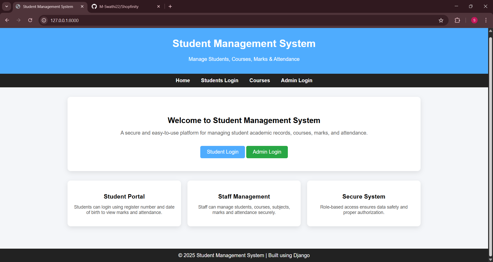
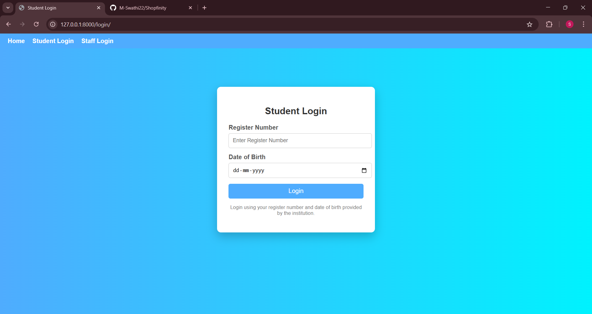
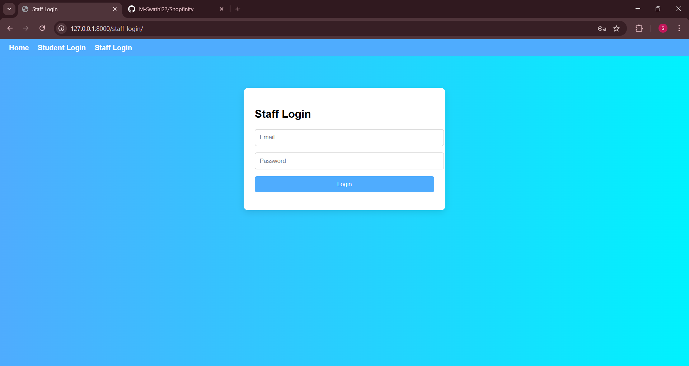

# 🎓 Student Management System (Django)

A web-based Student Management System built using **Django** to manage students, courses, subjects, marks, and attendance.

This project provides separate login access for **Students** and **Staff (Admin)** with role-based dashboards.

---

## 🚀 Features

### 👩‍🎓 Student Module
- Student login using Register Number & Date of Birth
- View personal details
- View marks
- View attendance
- Secure session-based access

### 👨‍🏫 Staff (Admin) Module
- Staff login
- Staff dashboard
- Add / View / Edit / Delete students
- Manage courses
- Add subjects to courses
- Add student marks
- Add student attendance

### 🌐 General
- Clean and user-friendly UI
- Responsive design (mobile, tablet, laptop)
- Role-based navigation
- Secure Django backend

---

## 🛠️ Technologies Used

- **Backend:** Python, Django  
- **Frontend:** HTML, CSS  
- **Database:** SQLite (can be switched to MySQL)  
- **Tools:** VS Code, Git, GitHub  

---

## 📂 Project Structure (Simplified)

SMS_Project/
│
├── students/
│ ├── models.py
│ ├── views.py
│ ├── urls.py
│
├── staff/
│ ├── models.py
│ ├── views.py
│ ├── urls.py
│
├── templates/
│ ├── base.html
│ ├── home.html
│ ├── student_login.html
│ ├── student_dashboard.html
│ ├── student_marks.html
│ ├── student_attendance.html
│ ├── staff_dashboard.html
│ ├── add_student.html
│ ├── view_students.html
│ ├── courses.html
│ ├── subjects.html
│
└── README.md

---

## 🔐 Login Details (Sample)

### Student Login
- Register Number
- Date of Birth

### Staff Login
- Username
- Password

---

## 📸 Screenshots

### 🏠 Home Page

### 🎓 Student Login

### 👨‍🏫 Staff Login

---

## 🎯 Future Enhancements

- Export marks/attendance as PDF
- Password reset
- Search & filter students
- Email notifications
- Improved UI with Bootstrap

---

## 👩‍💻 Author

**Swathi M**  
B.E – Electronics and Communication Engineering  
Python Full Stack Developer (Fresher)

📌 GitHub: [M-Swathi22](https://github.com/M-Swathi22)

---

⭐ If you like this project, feel free to star the repository!
